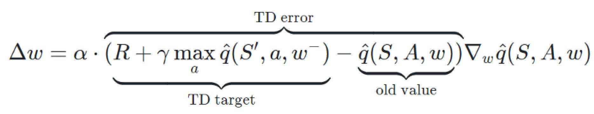
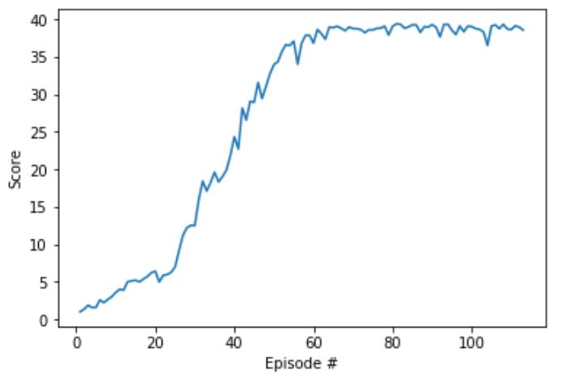

# Project 2 - Continuous Control
---
Author: Andrew Zhao

## Executive Summary
This project consist of training a reinforcement learning agent that learns to control 20 double-jointed arms to target locations. The goal is to accumulate an average reward of 30 in this environment across the 20 parallel agents. A subclass of actor-critic reinforcement learning agent called a Deep Deterministic Policy Gradients agents will be used to solve the environment.

## The Environment
A reward of +0.1 is provided for each step that the agent's hand is in the goal location. Thus, the goal of the agent is to maintain its position at the target location for as many time steps as possible.

The observation space consists of 33 variables corresponding to position, rotation, velocity, and angular velocities of the arm. Each action is a vector with four numbers, corresponding to torque applicable to two joints. Every entry in the action vector should be a number between -1 and 1.

To solve the environment, the 20 agents must get an average score of +30 over 100 consecutive episodes.

## The Algorithm
The actor network consist of 3 fully connected layers with input of size of states, second hidden size of 256, third hidden size of 128 and output size of size of actions. As for the critic network, it consist of the same architecture. The hidden size was chosen from hyperparameter tuning from trial and error. All the fully connected layers are uniformly initialized based on the size of input sizes.

Deep Deterministic Policy Gradient is a subclass of the Actor Critic methods. Contrary to vanilla Actor Critic methods, the DDPG's actor outputs a deterministic policy and trained using the deterministic policy gradient algorithm. Additionally, the critic is trained by using the TD error. 

The DDPG implementation also incorporated some other reinforcement learning techniques that were used to help with convergence.

##### Experience Replay
When the agent interacts with the environment, the sequence of experience tuples can be highly correlated. A naive algorithm that learns from each of these experience tuples in sequential order runs the risk of getting swayed by the effects of this correlation. By instead keeping track of a replay buffer and using experience replay to sample from the buffer at random, we can prevent action values from oscillating or diverging catastrophically. The replay buffer contains a collection of experience tuples. The tuples are gradually added to the buffer as we are interacting with the environment. The act of sampling a small batch of tuples from the replay buffer in order to learn is known as experience replay. In addition to breaking harmful correlations, experience replay allows us to learn more from individual tuples multiple times, recall rare occurrences, and in general make better use of our experience.

##### Fixed Q-Targets
To avoid update a guess with a guess, we can update the parameters w in the network qhat to better
approximate the action value corresponding to state S and action A with the following update
rule:

Where w- are the weights of a separate target network that are not changed during the learning
step, and (S,A,R,S’) is an experience tuple.

##### Soft Updates
By using soft updates, we slowly blending local network weights with the target network weights.

## Hyperparameters
The project employed the following hyperparameters which are either used based on paper suggestions as well as tuned using trail and error.

| Hyperparameter                      | Value |
| ----------------------------------- | ----- |
| Replay buffer size                  | 1e6   |
| Batch size                          | 128   |
| $\gamma$ (discount factor)          | 0.99  |
| $\tau$                              | 1e-3  |
| Actor Learning rate                 | 1e-4  |
| Critic Learning rate                | 5e-4  |
| Update interval                     | 20    |
| Update passes per interval          | 10    |
| Number of episodes                  | 1000  |
| Max number of timesteps per episode | 1000  |

## Results
The DDPG 20 parallel agents beat the environment in 113 episodes. The agents first had an average of +30 score in Episode 46. 

The following graph shows the average score in each episode for all of the 20 DDPG agents. 

We can see that the agents flattened at around +38 score.

## Future Work
There are many points that the DDPG agent can improve on.
The first is the implementation of ***prioritized experience replay*** which can accelerate the rate of learning because the algorithm will tend to choose the experience that have the biggest TD error.

Additionally other algorithms like TRPO, PPO, A3C, A2C could be tried to compare results against the DDPG agents.