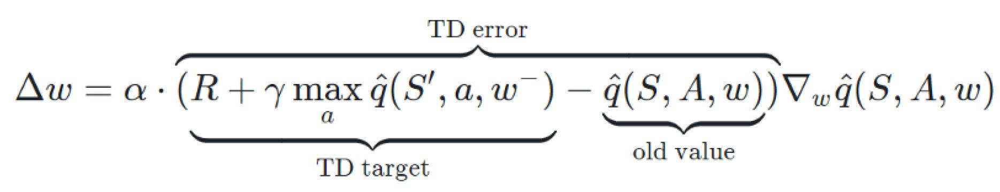
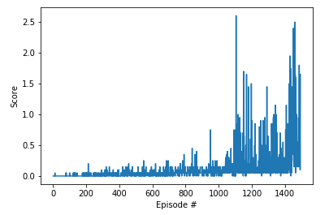

# Project 3 - Competition and Cooperation

Author: Andrew Zhao

## Executive Summary

This project consist of training a multi-agent reinforcement learning algorithm that learns to control 2 tennis rackets. The goal is to accumulate an average reward of 0.5 in this environment over 100 episodes. A subclass of actor-critic reinforcement learning agent called a Multi-Agent Deep Deterministic Policy Gradients agents will be used to solve the environment.

## The Environment

A reward of +0.1 is provided for each time a racket hits the ball over a net. If an agent lets a ball hit the ground or hits the ball out of bounds, it receives a reward of -0.01. Thus, the goal of the agent is to keep the ball in play as long as possible.

The observation space consists of 8 variables corresponding to the velocity of the ball and racket. Each agent receives its own local observation. Two continuous actions are available, corresponding to movement toward (or away from) the net, and jumping.

The task is episodic, and in order to solve the environment, the  agents must get an average score of +0.5 (over 100 consecutive episodes, after taking the maximum over both agents). Specifically,

- After each episode, we add up the rewards that each agent received  (without discounting), to get a score for each agent. This yields 2  (potentially different) scores. We then take the maximum of these 2  scores.
- This yields a single **score** for each episode.

The environment is considered solved, when the average (over 100 episodes) of those **scores** is at least +0.5.

## The Algorithm

The actor network consist of 3 fully connected layers with input of size of states, second hidden size of 256, third hidden size of 128 and output size of size of actions. As for the critic network, it consist of the same architecture. The hidden size was chosen from hyperparameter tuning from trial and error. All the fully connected layers are uniformly initialized based on the size of input sizes.

Multi-Agent Deep Deterministic Policy Gradient is a subclass of the Actor Critic methods. Contrary to vanilla Actor Critic methods, the MADDPG's actor outputs a deterministic policy and trained using the deterministic policy gradient algorithm. Additionally, the critic is trained by using the TD error. 

Specifially, the MADDPG algorithm trains two agent in this environment, each controls one of the rackets. The agents need to collaborate and compete at the same time. Additionally, the agent's critic are using states and actions from both agents while the actor for both agents are trained using their own observations. 

The MADDPG implementation also incorporated some other reinforcement learning techniques that were used to help with convergence.

##### Experience Replay

When the agent interacts with the environment, the sequence of experience tuples can be highly correlated. A naive algorithm that learns from each of these experience tuples in sequential order runs the risk of getting swayed by the effects of this correlation. By instead keeping track of a replay buffer and using experience replay to sample from the buffer at random, we can prevent action values from oscillating or diverging catastrophically. The replay buffer contains a collection of experience tuples. The tuples are gradually added to the buffer as we are interacting with the environment. The act of sampling a small batch of tuples from the replay buffer in order to learn is known as experience replay. In addition to breaking harmful correlations, experience replay allows us to learn more from individual tuples multiple times, recall rare occurrences, and in general make better use of our experience.

##### Fixed Q-Targets

To avoid update a guess with a guess, we can update the parameters w in the network qhat to better
approximate the action value corresponding to state S and action A with the following update
rule:

Where w- are the weights of a separate target network that are not changed during the learning
step, and (S,A,R,S’) is an experience tuple.

##### Soft Updates

By using soft updates, we slowly blending local network weights with the target network weights.

## Hyperparameters

The project employed the following hyperparameters which are either used based on paper suggestions as well as tuned using trail and error.

| Hyperparameter                      | Value |
| ----------------------------------- | ----- |
| Replay buffer size                  | 1e6   |
| Batch size                          | 128   |
| $\gamma$ (discount factor)          | 0.99  |
| $\tau$                              | 5e-2  |
| Actor Learning rate                 | 1e-3  |
| Critic Learning rate                | 1e-3  |
| Update interval                     | 20    |
| Update passes per interval          | 10    |
| Number of episodes                  | 10000 |
| Max number of timesteps per episode | 10000 |

## Results

The MADDPG algorithm beat the environment in 1493 episodes. The agents first had an average of +0.5 score in Episode 950. 

The following graph shows the average score in each episode. 

## Future Work

There are many points that this solution can be improved upon.
The first is the implementation of ***prioritized experience replay*** which can accelerate the rate of learning because the algorithm will tend to choose the experience that have the biggest TD error.

Additionally other algorithms like TRPO, PPO, A3C, A2C could be tried to compare results against MADDPG.